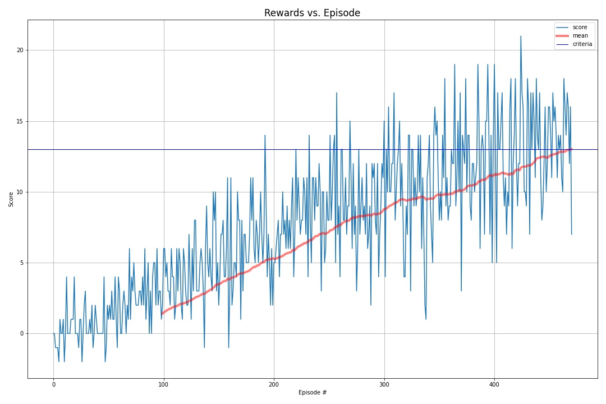

[//]: # (Image References)

[image1]: https://user-images.githubusercontent.com/10624937/42135619-d90f2f28-7d12-11e8-8823-82b970a54d7e.gif "Trained Agent"

# Project 1: Navigation

### Introduction

For this project, you will train an agent to navigate (and collect bananas!) in a large, square world.  

![Trained Agent][image1]

A reward of +1 is provided for collecting a yellow banana, and a reward of -1 is provided for collecting a blue banana.  Thus, the goal of your agent is to collect as many yellow bananas as possible while avoiding blue bananas.  

The state space has 37 dimensions and contains the agent's velocity, along with ray-based perception of objects around agent's forward direction.  Given this information, the agent has to learn how to best select actions.  Four discrete actions are available, corresponding to:

- **`0`** - move forward.
- **`1`** - move backward.
- **`2`** - turn left.
- **`3`** - turn right.

The task is episodic, and in order to solve the environment, your agent must get an average score of +13 over 100 consecutive episodes.


### Key Files
* Navigation.py: the main routine for the basic-banana project. It is the high-level calls to construct the environment, agent, train and play. 
* Navigation_Pixels.py: the main routine for the challenge project - visual banana.
* dqn_agent.py: the class definitions of the agent and replay buffer.
* model.py: the deep neural network models are defined in this file.
* model.pth: saved weights for basic banana.


### Description of the learning algorithm

1. Built a QNetwork used as Q-table. The input to the NN is state
The output is the q values associate with the 4 action of the agent. The NN is composited by 1 input layer, 1 hidden layer, and 1 output layer.

2. Created an Agent object to represent the "Player". The agent used a fixed Q-Targets (local q-table vs. target q-table) strategy, as well as Experience Replay, which stores the past SARSA tuples, and sample the training batch from it. The Target Q-table is updated after every 4 steps of training.

3. Built the DQN function, and trained the Agent with the Qnetwork.

The model reached >13 pts rewards after 400~500 episodes.

#### To run the code, just run through the cells in `Navigation.ipynb`.


#### Training: DQN and Agent

The DQN used in this implementation is the simple DQN with two networks: one is local, and one is target.

In dqn_agent.py, the network is created with these lines:

```python
self.qnetwork_local = QNetwork(state_size, action_size, seed).to(device)
self.qnetwork_target = QNetwork(state_size, action_size, seed).to(device)
```

For basic-banana project, the training parameters are as follows:

In the ```dqn()``` function:

```python
n_episodes=2000
max_t=1000
eps_start=1.0
eps_end=0.01
eps_decay=0.995
```

In the dqn_agent.py file: the Agent class has parameters to learn():

```python
BUFFER_SIZE = int(1e5)
BATCH_SIZE = 64
GAMMA = 0.99
TAU = 1e-3
LR = 5e-4
UPDATE_EVERY = 4
```

#### Neural Network Models

The neural networks are defined in the model.py file. 
It contains two fully connected layers. Each layer contains 64 neurons. 

```python
x = F.relu(self.fc1(state))
x = F.relu(self.fc2(x))
x = self.fc3(x)
```
#### Results

##### Basic Banana

```angular2html
Episode 100	Average Score: 0.42
Episode 200	Average Score: 3.66
Episode 300	Average Score: 6.60
Episode 400	Average Score: 9.84
Episode 500	Average Score: 12.81
Episode 512	Average Score: 13.02
Environment solved in 412 episodes!	Average Score: 13.02
```



#### Ideas for future improvements

For future improvements - the challenge project:
* The agent could be able to achieve higher score if trained longer
* Using other advanced DQN, such as dueling, replay buffer prioritization, rainbow, etc.
* Specially, Prioritized Experience Replay (PER) could be implemented to further enhance the performance of the agent. PER is to mimic the fact in real world that we turn to think more often on big transition/event/reward. For implementing PER, the Sum Tree data structure can be used as it helps in a faster implementation of Prioritized Experience Replay.


## Project Instruction from Udacity
### Getting Started

1. Install UNITY and ML-Agent following this instruction: 
[Link](https://github.com/Unity-Technologies/ml-agents/blob/master/docs/Installation.md)

To install Unity on Ubuntu, see this post:
[Link](https://forum.unity.com/threads/unity-on-linux-release-notes-and-known-issues.350256/page-2)

2. Download the environment from one of the links below.  You need only select the environment that matches your operating system:
    - Linux: [click here](https://s3-us-west-1.amazonaws.com/udacity-drlnd/P1/Banana/Banana_Linux.zip)
    - Mac OSX: [click here](https://s3-us-west-1.amazonaws.com/udacity-drlnd/P1/Banana/Banana.app.zip)
    - Windows (32-bit): [click here](https://s3-us-west-1.amazonaws.com/udacity-drlnd/P1/Banana/Banana_Windows_x86.zip)
    - Windows (64-bit): [click here](https://s3-us-west-1.amazonaws.com/udacity-drlnd/P1/Banana/Banana_Windows_x86_64.zip)
    
    (_For Windows users_) Check out [this link](https://support.microsoft.com/en-us/help/827218/how-to-determine-whether-a-computer-is-running-a-32-bit-version-or-64) if you need help with determining if your computer is running a 32-bit version or 64-bit version of the Windows operating system.

    (_For AWS_) If you'd like to train the agent on AWS (and have not [enabled a virtual screen](https://github.com/Unity-Technologies/ml-agents/blob/master/docs/Training-on-Amazon-Web-Service.md)), then please use [this link](https://s3-us-west-1.amazonaws.com/udacity-drlnd/P1/Banana/Banana_Linux_NoVis.zip) to obtain the environment.

3. Place the file in the DRLND GitHub repository, in the `p1_navigation/` folder, and unzip (or decompress) the file. 

### Instructions

Follow the instructions in `Navigation.ipynb` to get started with training your own agent!  

### (Optional) Challenge: Learning from Pixels [Not Done Yet]

After you have successfully completed the project, if you're looking for an additional challenge, you have come to the right place!  In the project, your agent learned from information such as its velocity, along with ray-based perception of objects around its forward direction.  A more challenging task would be to learn directly from pixels!

To solve this harder task, you'll need to download a new Unity environment.  This environment is almost identical to the project environment, where the only difference is that the state is an 84 x 84 RGB image, corresponding to the agent's first-person view.  (**Note**: Udacity students should not submit a project with this new environment.)

You need only select the environment that matches your operating system:
- Linux: [click here](https://s3-us-west-1.amazonaws.com/udacity-drlnd/P1/Banana/VisualBanana_Linux.zip)
- Mac OSX: [click here](https://s3-us-west-1.amazonaws.com/udacity-drlnd/P1/Banana/VisualBanana.app.zip)
- Windows (32-bit): [click here](https://s3-us-west-1.amazonaws.com/udacity-drlnd/P1/Banana/VisualBanana_Windows_x86.zip)
- Windows (64-bit): [click here](https://s3-us-west-1.amazonaws.com/udacity-drlnd/P1/Banana/VisualBanana_Windows_x86_64.zip)

Then, place the file in the `p1_navigation/` folder in the DRLND GitHub repository, and unzip (or decompress) the file.  Next, open `Navigation_Pixels.ipynb` and follow the instructions to learn how to use the Python API to control the agent.

(_For AWS_) If you'd like to train the agent on AWS, you must follow the instructions to [set up X Server](https://github.com/Unity-Technologies/ml-agents/blob/master/docs/Training-on-Amazon-Web-Service.md), and then download the environment for the **Linux** operating system above.
