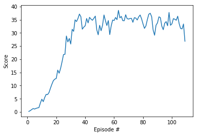
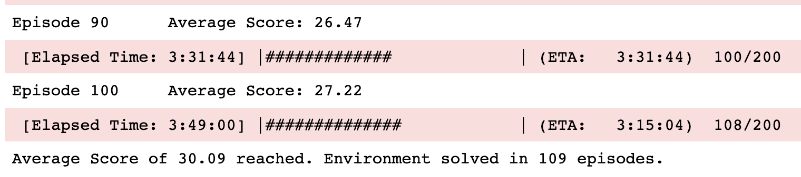

## Project Summary:
### Conda Environment Setup
to run this project you need to set up your conda environment as follows.  

```
buildoutcfg
conda create python=3.6 -n unity
conda activate unity
conda install numpy, pytorch
pip install unityagents
pip install mlagents
```

the baseline code used for this project was borrowed from ddpg-pendulum directory in this repo.
The following changes were applied to the code

### Unity Environment and Project Objective:
Number of agents: 1 if `./Reacher_Linux/Reacher.x86_64` is used or 20 if `./Reacher_Linux_multi/Reacher.x86_64` is used 
Size of each action is 4. Every entry in the action vector should be a number between -1 and 1.
Each action is a vector with four numbers, corresponding to torque applicable to two joints. 
Each agent observes a state with length 33 corresponding to position, rotation, velocity, and angular velocities of the arm. 
The task is episodic, and in order to solve the environment,
the agent must get an average score of +30 over 100 consecutive episodes.

In this environment, a double-jointed arm can move to target locations. 
A reward of +0.1 is provided for each step that the agent's hand is in the goal location. 
Thus, the goal of your agent is to maintain its position at the target location for as 
many time steps as possible

### Code Structure
* __Continous_Control.ipynb__: the main routine for the project. It is the high-level calls to construct the environment, agent, train and play. 
contains the code to implement this project:
   * Random robot arms to get familiar with the Unity environment
   * Running the simulation to training the critic-actor models 
   * Observing how the model does for a single arm


* __ddpg_agent.py__: the class definitions of the agent and replay buffer. It contains the class Agent which is responsible for interacting with the unity environment to collect experiments and contains the loss functions for actor-critic model.
The code also contains class for random sampling from experiments, and generating random noise for actions. This random noise added to actions is essentially similar to epsilon greedy in which we act in a sub-optimal way to collect more information. In the final implementation the noise variance is reduced with more iterations. 

* __model.py__:
contains the actor and critic models. The model structure is fairly simple except for one interesting piece:

```
    def forward(self, state, action):   
        """
        Build a critic (value) network that maps (state, action) pairs -> Q-values.
        """
        xs = F.relu(self.batch_norm_fcs1(self.fcs1(state)))
        x = torch.cat((xs, action), dim=1)
``` 

here we are estimating Q(A, S) in a peculiar way, by passing the state first into a FC layer, 
then concatenating the output with action. This as oppose to concatenating action and state and then
feeding the resulting tensor to a FC layer. My intuition is that this approach allows the model 
to capture the interaction between A, S easier. 

* __workspace_utils.py__: a helper function to facilite the workspace training on Udacity.

* __checkpoint_actor.pth__: model parameters for actor NN.
* __checkpoint_critic.pth__: model parameters for critic NN.
* __Unity environments__:
Udacity has built 2 environments one with 1 agent and the other with 20 agents. Place the folder in the `p2_continous-control` folder. 

### Code Changes Implemented
I essentially used the DDPG implementation along with the recommendation from the udacity. 
The key features of my implementation are as follows:
1) using the 20 agent implementation of unity instead of 1 agent. 
this allows me to collect 20 times more experiment in the same amount of time.

2) I unwrap the 20 experiments inside the step function and add them one by one to the replay buffer

3) after each action and collected reward and adding 20 new data points to the replay buffer,
i run the training 10 times. 
    
    for _ in range(10):
        experiences = self.memory.sample()

4) gradient clipping was uses as suggested by Udacity:

        # Minimize the loss
        self.critic_optimizer.zero_grad()
        critic_loss.backward()
        torch.nn.utils.clip_grad_norm(self.critic_local.parameters(), 1)
        self.critic_optimizer.step()
        
6) the noisy action function was adjusted to inject independent noise for each agent:
        
        if add_noise:
            noise = np.array([self.noise.sample() for _ in range(20)])
            action += noise

7) Learning algorithm is Adams optimization. 

The general idea is that we train two models: (1) actor: estimates the arg-max Q(S,a) and (2) Critic: estimares the Q(S, a). Both models have a local and target model. The local model is trained using Adams optimization, while the target model parameters lags behind the local model and evolves more slowly. Some of the hyper-paramaters are as follows


        BUFFER_SIZE = int(1e5)  # the maximum size of (S, A, R, S', Done) experience tuples that we hold into memory
        BATCH_SIZE = 128  # training batch size
        TAU = 1e-3  # for soft update of target parameters
        LR_ACTOR = 1e-4  # learning rate of the actor model
        LR_CRITIC = 1e-3  # learning rate of the critic model
        NOISE_DECAY_MULTIPLIER = 0.9999 # reducing the random action noise by this factor in each iteration


### Performance
it was very difficult to get the performance improve over time. The biggest problem was that my average score gets stuck and would not improve within the first 20
episodes and won't improve. Here are some of the things i tried:
1) batch normalization was added according to the student discussion here: https://knowledge.udacity.com/questions/58977 and noticed improvement
2) noise was decayed according to https://knowledge.udacity.com/questions/58977
3) Train 10 times after each action (collect 20 new samples)




I need 109 episodes to get to score of 30.09. 

### Concepts and Learnings:
#### What is Replay Buffer 
notice throughout this whole training we keep on accumulating 100,000 experience tuples 
is the limit of how many experiences we collect before stating to throw away the earlier ones
notice that state, action, reward, next_state, done , for a deterministic simulator
is not at all a function of policy or Q. policy, actor, critic may impact how frequently
we perform an action but once the action is performed the next state and reward is derived from the
simulation. For example for a deterministic simulation if we are in state S , take action A, we will
end up in state S' , and this is independent of the models we are training.
so this means the experiences we are collecting better cover a large range of actions and states
so we can learn from them. This is why we play freely and then we learn, and we use epsilon greedy to try
random things so we get to collect reward and better estimate Q(S, A) for a wide combination of S, A
after several iterations, actor starts to reduce the number of random actions and we start acting
optimally according to actor function approximation.


#### Actor & Critic; Local & Target 
`Local` vs. `Target`:
    The `Local` serves as a generator, while the `Target` tries to keep the latency of the model.

`Actor` vs. `Critic`:
    The `critic_local` is first updated based on the loss calulated from `critic_local` (with __current_state__) and `critic_target`(with __next_state__, plus __current_reward__).
    
Then, the `actor_local` is updated based on the __mean__ of updated `critic_local`, with action from `actor_local`.

Lastly the `actor_target` and `critic_target` are updated with a factor __TAU__(slow evolving).
    

### Future Ideas:
1) Use image pixels as state representation rather than the 33 values provided in the course
and use CNNs instead of FC. The problem is that the environment is 3D. 
2) Exploring other actor-critic algorithms and materials in the class such as the ones introduced here: 
https://arxiv.org/abs/1604.06778,
https://arxiv.org/pdf/1803.07067.pdf,
https://ai.googleblog.com/2016/10/how-robots-can-acquire-new-skills-from.html
https://www.manning.com/books/grokking-deep-reinforcement-learning?a_aid=gdrl  'gdrludacity40' gives you a 40% off.


