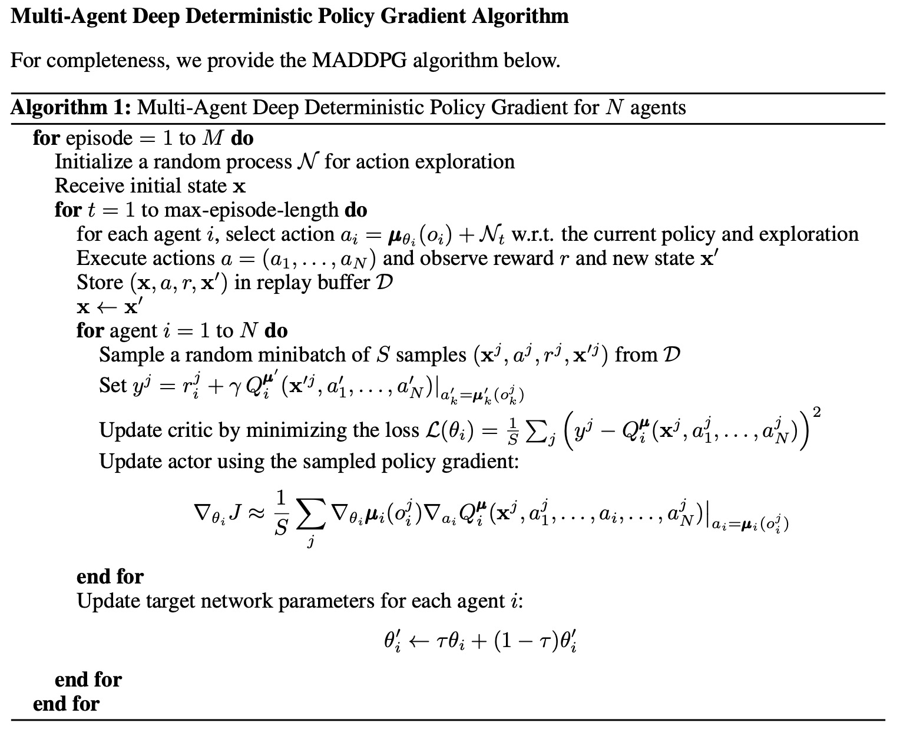
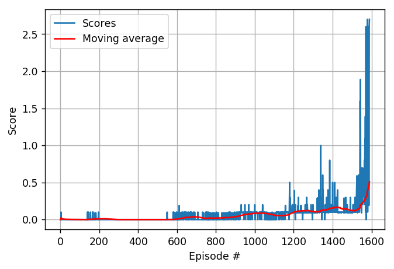
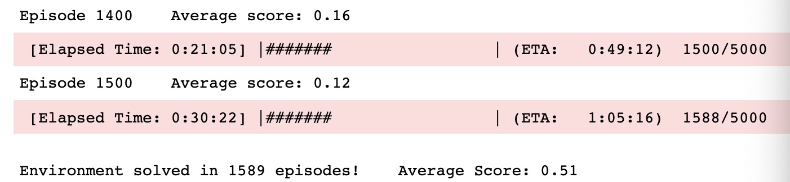

# Project Report

## Algorithm Selection 

I solved this project with **multi-agent reinforcement learning (MARL) method**  A.K.A. **Multi-Agent Deep Deterministic Policy Gradient (MADDPG)** algorithm ([**link**](https://arxiv.org/abs/1706.02275)). 

**MADDPG** a multi-agent actor-critic algorithm for mixed cooperative-competetive environments. It is an extension of **DDPG** ([**link**](https://arxiv.org/abs/1509.02971)) to the multi-agent setting.

The pesudo code of the algorithm as in the paper is shown below:

  

### Key components of **MADDPG for N-agents**
- **Actor-critic architecture** with two elements, actor and critic.
  - Deterministic actor (policy) **for each agent**, where actor function only has access to local information (i.e. agent's own observations).
  - Centralized critic (action-value) function that explicitly uses the dicision-making policies (a1,..., a*N*;) of each agent in addition to the all their
  observation (x, x').
- As in Deep Q-network to adapt the Q-learning algorithm in order to make effective use of large neural networks as function approximators and avoid instability of learning are used **two important techniques**:
  - ***Shared* Experience Replay**: The actor and critic networks are trained off-policy with samples uniformly  from replay buffer to minimize correlations between samples.
  - Separate **target network**: The critic network is trained with both actor and critic target networks to give consistent target values during temporal difference backups.
- **Decayed random noise process for action exploration**: Add noise sampled from *Ornstein-Uhlenbeck process* to actor policy. In addtion, the nosie is deflated with factor to make the actor model more determinstic.
- **“Soft” target updates**: The weights of targets networks are updated by having them slowly track the learned networks, so the target values are constrained to change slowly, greatly improving the stability of learning.
- The **weights** of an actor/critic network is estimated through gradient ascent/descent.

### Hyperparameters and model architecture description
For learning the neural network parameters we use `Adam algorithm` with a learning rate of 1e-4 and 1e-3 for the actor (`LR_ACTOR`) and critic (`LR_CRITIC`) networks respectively. 
For compute Q target we use a discount factor (`GAMMA`) of = 0.99. For the soft target updates we use &tau; (`TAU`) = 0.001. The neural networks use ``relu`` activation for all hidden layers. 
Since every entry in the action must be a number between -1 and 1 we add a tanh activation function to the final output layer of the actor network. 
The both actor and critic networks have 2 hidden layers with 200 and 150 units . 
Actions are included before the 1nd hidden layer of critic network. The final layer weights and biases of both the actor and critic networks are initialized from a uniform distribution [-3e-3, 3e-3] to provide the initial outputs for the policy and value estimates are near zero. 
The other layers are initialized from uniform distributions [-1/<var></var>√<var>f</var>, 1/<var></var>√<var>f</var>] where *f* is the fan-in of the layer. 
We train during 5000 episodes with minibatch sizes (`BATCH_SIZE`) of 250 and use a replay buffer size (`BUFFER_SIZE`) of 1e+5.
For the exploration noise process we use an *Ornstein-Uhlenbeck process* with &theta; = 0.15 and &sigma; = 0.2, and agent-dependent noise decay factor ``NOISE_DECAY_MULTIPLIER`` = 0.9999.
## Performance
It was very difficult to get the performance improve over time. The biggest problem was that my average score gets stuck and would not improve within the first 20 episodes and won't improve. Here are some of the things i tried:

- batch normalization was added according to the student discussion [**here**](https://knowledge.udacity.com/questions/58977), and noticed improvement.

- noise was decayed according to [**this**] (https://knowledge.udacity.com/questions/58977).

## Conclusion

  

Environment solved in 1589 episodes!	Average Score: 0.51

  

## Ideas for future

- Implement [**multi-agent TD3 (MATD3)**](https://arxiv.org/abs/1910.01465) algorithm.
- Experiment with [**Parameter Space Noise for Exploration**] (https://arxiv.org/abs/1706.01905).
- Use [**Prioritized Experience Replay**](https://arxiv.org/abs/1511.05952).
